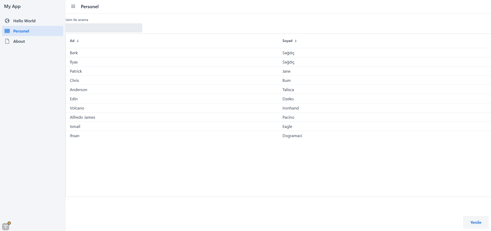
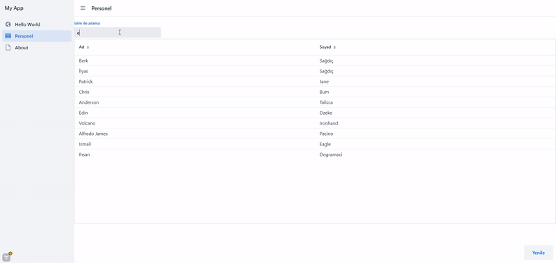
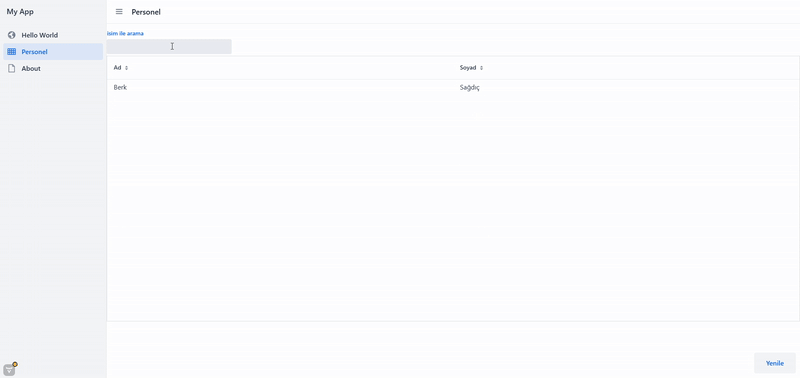

# Monad Task

---

--- 

## **Arama işlemi** 

--- 

## **Ekleme işlemi**

---

## 1. **Proje Kurulumu ve Vaadin Sayfalarının Oluşturulması**

İlk adımda, Vaadin Framework kullanarak aşağıdaki sayfalar oluşturdum:
- **Hello World**
- **About**

Bu sayfaların oluşturulmasının ardından, Vaadin arayüzü üzerinden **Personel** adında yeni bir tab ekledim. Bu tabın içeriğini doldurmak amacıyla uygulama dosyalarını indirdim.

---

## 2. **Projeyi Çalıştırmak için Yapılandırma**

1. İndirilen `.zip` uzantılı dosyayı **Intelij IDEA**'ya aktararak projeyi açtım.
2. **Maven** bağımlılıkları, **Java** sürümü ve **Spring** versiyonu kontrolü gerçekleştirdim.
3. Maven bağımlılıklarını tekrar yükleyerek projeyi başarıyla çalıştırdım.

---

## 3. **Model Katmanının Oluşturulması**

Uygulama yapısında **model** adında bir paket oluşturdum. Bu pakette **Personel.java** adında bir sınıf oluşturup, personel verisini modellemek için aşağıdaki alanları tanımladım:

- `String TC`
- `String Ad`
- `String Soyad`

Ayrıca, bu sınıfa gerekli **getter** ve **setter** metodlarını ekleyerek, veri manipülasyonunu mümkün kıldım.

---

## 4. **Servis Katmanının Eklenmesi**

MVC mimarisine uygun olarak, **service** katmanını eklemem gerekti. Bu sebeple:
1. **service** adında bir paket oluşturdum.
2. **PersonelService.java** dosyasını oluşturup, 10 adet personel verisini tanımladım.
3. Bu verilere erişebilmek için **getPersonels** metodunu servis katmanına ekledim.

---

## 5. **Personel Grid ve Arama Kutusunun Eklenmesi**

Personel View'ini Vaadin üzerinden boş olarak oluşturduktan sonra, aşağıdaki adımları takip ettim:
- **Grid**: Personel verilerini gösterecek şekilde yapılandırıldı.
- **Arama Kutusu (Search Box)**: Kullanıcıların personel adlarına göre arama yapabilmesini sağlamak için Vaadin TextField kullanarak bir arama kutusu ekledim.

Vaadin dökümantasyonlarından yararlanarak gerekli Grid ve Arama kutusu bileşenlerini entegre ettim.

---

## 6. **Personel ekleme**

Öncelikle, Vaadin butonunu ekledim ve bir event tanımladım. 
Bu event sayesinde sabit bir veri ekleyebildim. Ardından, 
butonun stil özelliklerini değiştirerek istenilen konumda olmasını sağladım.

---

## 7. **Passive View Prensibinin uygulanması**
Passive View prensibini araştırdım ve View sınıfında verilerin değiştirilmesi, 
arama gibi işlemlerin olmaması gerektiğini fark ettim. 
Bu işlemleri tamamen service katmanına taşıdım. Ardından daha detaylı bir araştırma yaptığımda
servis çağrılarının viewde olmaması gerektiğini aracı bir katman ile view elemanlarına atama yapabileceğimi öğrendim.
PersonelController adında bir presenter(Sunum) classı oluşturdum ve içerinde Getter metodları sayesinde servisten gelen dataProviderı Grid içerine atadım.
Ardından TextFiel nesnesine serviste bulunan arama methodunu ekledim ekledim. Son olarak da yenile butonuna bir servis metodu atayarak viewdeki tüm servis işlemlerini kaldırdım

--- 

## 8. **View Son Güncelleme**
öncelikle style ayarlarını tek bir metod olarak yazdım ve constructerı daha temiz hale getirdim.
Ardından initView Metodunu da ekledim ve çalışıp çalışmadığını kontrol ettim. Herhangi bir hataya rastlamadım. 

--- 

> **Okuduğunuz için teşekkürler**

